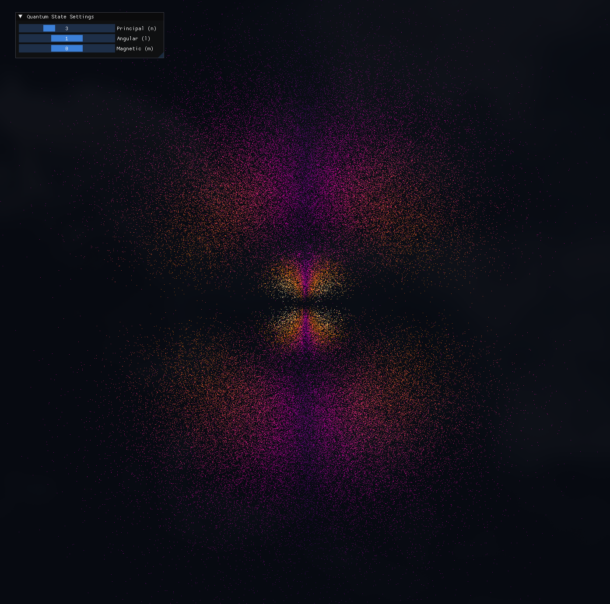
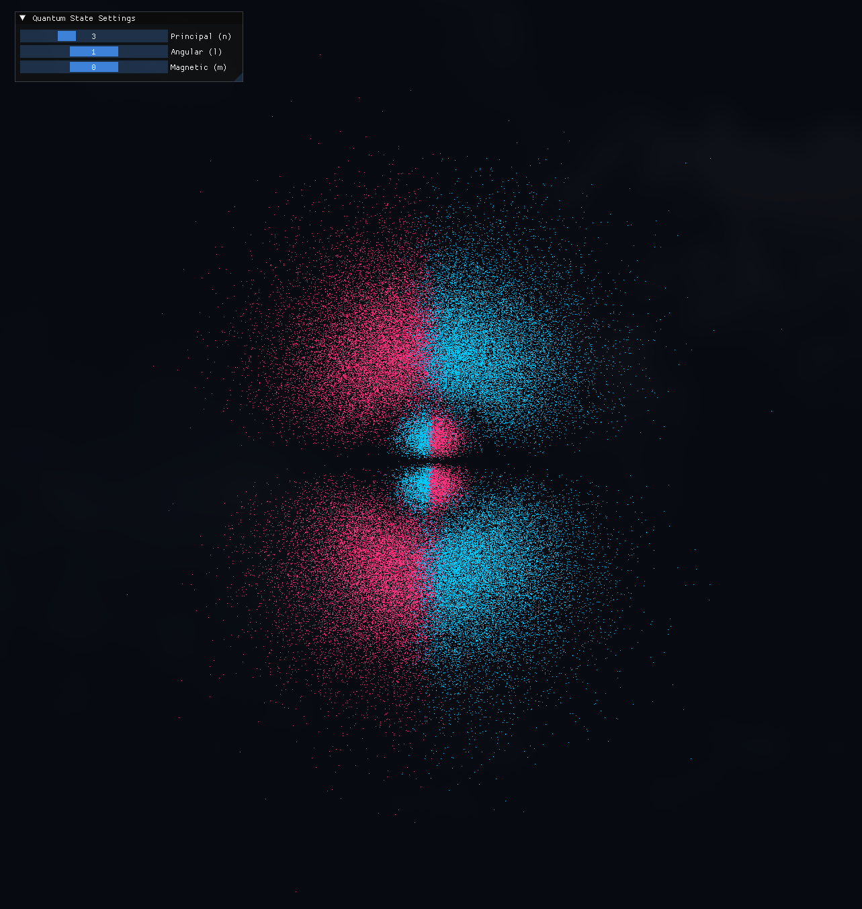
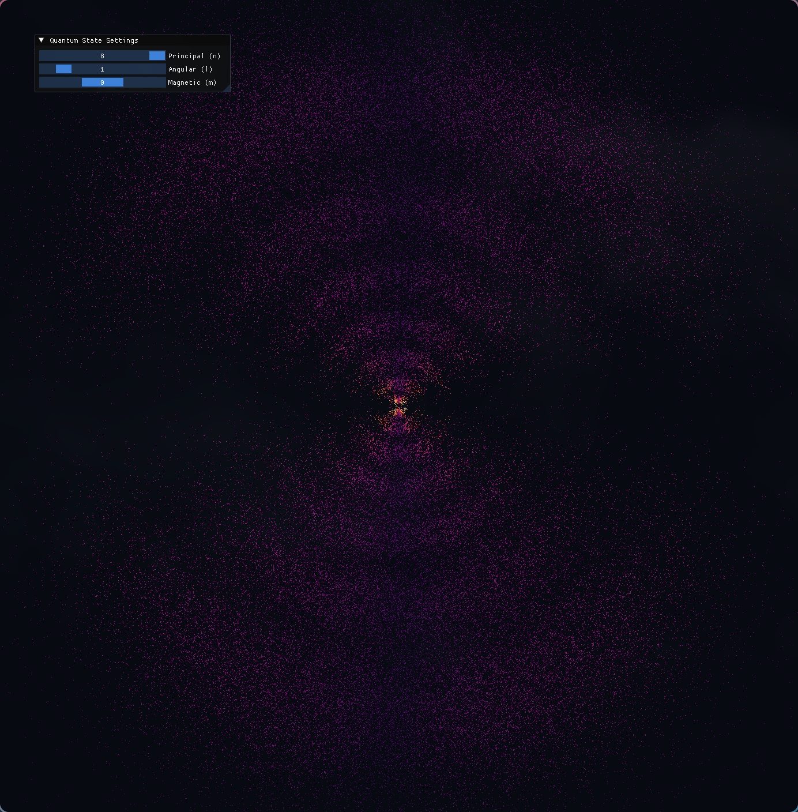
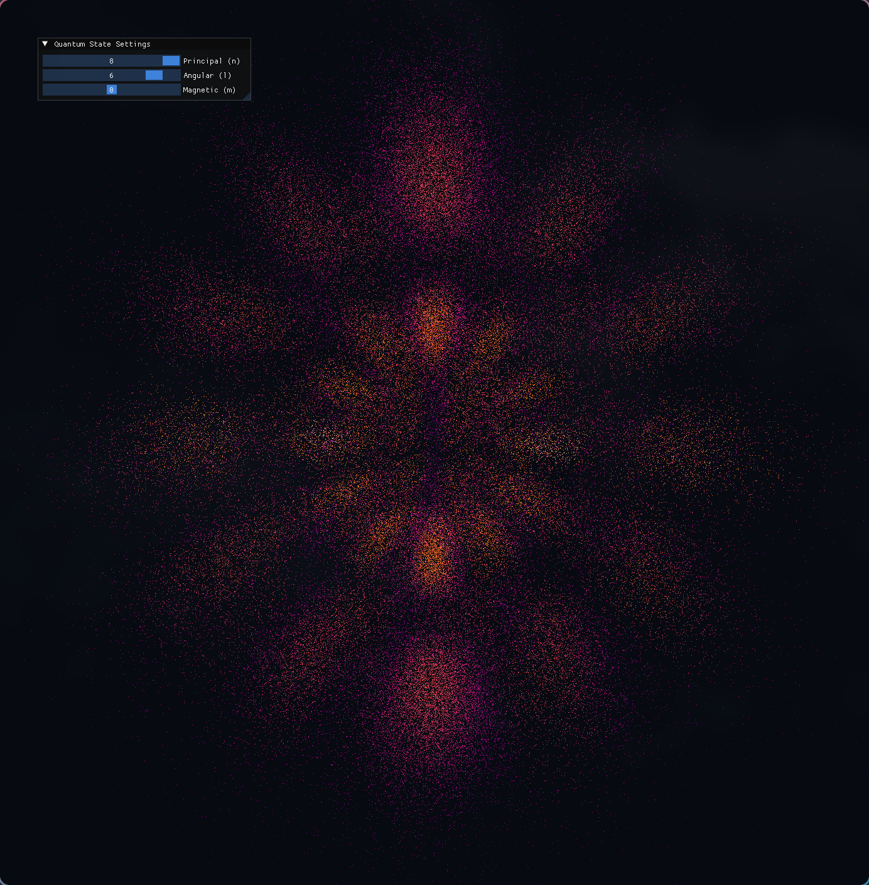

# ATOMIC ORBITALS VISUALISER

# PROJECT DESCRIPTION

This program simulates *atomic orbitals* according to the solutions to the [Schrödinger equation](https://en.wikipedia.org/wiki/Schr%C3%B6dinger_equation) for the hydrogen atom.

> [!note] 
> Note that I am not a physics student, therefore this project is a result of my **limited** knowledge of the topic.
> Nevertheless, I find this simulation to be a *good enough* representation of the underlying mechanics (or at least hope so).

## SHOWCASE

When you run the program, the default state is given by the following quantum numbers:
- **n** : 1
- **l** : 0
- **m** : 0

You can adjust the sliders int the provided GUI to visualise orbitals corresponding to different combinations of quantum numbers, with the following constraints:
- **n** must be an integer between 1 and 8.
- **l** must be an integer between 0 and n-1.
- **m** must be an integer in the range $\[-l, +l\]$.

You can move the camera by *clicking and dragging* with your mouse cursor.



In the above example, you can see the orbital resulting from *n=3, l=1, m=0*.
The color coding reflects the *probability density* of finding the electron: *gold-ish* colors represent high probability areas and *purple-ish* colors represent low probability.

By pressing `v` you can toggle a different view, as shown below:



Now the orbitals are pictured in *two distinct colors* representing the *phase* (or *polarity*) of each area of the clouds.

## MORE EXAMPLES

More (interesting) configurations are shown below:





# DEPENDENCIES

The following dependencies are *already included*:
- **glad**
- **ImGui**

You *do not* need to install these two.

To build and run the project, you do **need to install the following dependencies**:
- **CMake (v3.10+)**
- **GLFW (v3.3+)**
- **GLM (OpenGL Mathematics)**

## LINUX INSTALLATION

Depending on your distribution, you can install the required packages using your system's package manager.

**Ubuntu / Debian:**
```bash
sudo apt install build-essential cmake libglfw3-dev libglm-dev
```

**Fedora:**
```bash
sudo dnf install cmake glfw-devel glm-devel
```

**Arch:**
```bash
sudo pacman -S base-devel cmake glfw glm
```

## WINDOWS INSTALLATION

The easiest way to install the required dependencies is via [vcpkg](https://vcpkg.io/en/):

1. **Install vcpkg:**
    Open PowerShell and run:
    ```bash
    git clone https://github.com/microsoft/vcpkg.git
    cd vcpkg
    .\bootstrap-vcpkg.bat
    ```
2. **Install GLFW and GLM:**
    Run:
    ```bash
    .\vcpkg install glfw3 glm
    ```
3. **Link vcpkg to CMake:**
    When you will run the `cmake` command to build the project, you will need to 
    pass the correct toolchain file.
    It will look something like:
    ```bash
    cmake .. -DCMAKE_TOOLCHAIN_FILE="C:\path\to\vcpkg\scripts\buildsystems\vcpkg.cmake"
    ```

# BUILD AND RUN

## COMPILE THE PROJECT

1. **Clone the repo**
    ```bash
    git clone https:...
    cd Atomic-Orbitals-Visualiser
    ```
2. **Build**
    Create a `build` directory:
    ```bash
    mkdir build
    cd build
    ```
    And compile the project:
    ```bash
    cmake ..
    make
    ```

## RUN IT

Run with:
```bash
./AtomSimulation
```
on linux, or:
```bash
.\AtomSimulation.exe
```
on Windows.

**NOTE:** On Windows, depending on your compiler, CMake might place the executable in a subfolder.

# CREDITS AND ACKNOWLEDGEMENTS

The idea to make this project arose after watching this video by [kavan](https://youtu.be/OSAOh4L41Wg?si=RGSd5EBLWqY3ZUW1), which provided incredible insight into the core ideas behind the simulation.

As already stated in the [Dependencies](#DEPENDENCIES) section, I made use of many external, open source libraries:
- **GLFW**: For handling window creation and OpenGL interactions.
- **glad**: To load and manage OpenGL.
- **GLM**: To provide the required math to work with the 3D rendered scene.
- **ImGui**: To create a simple GUI to interact with the simulation.
